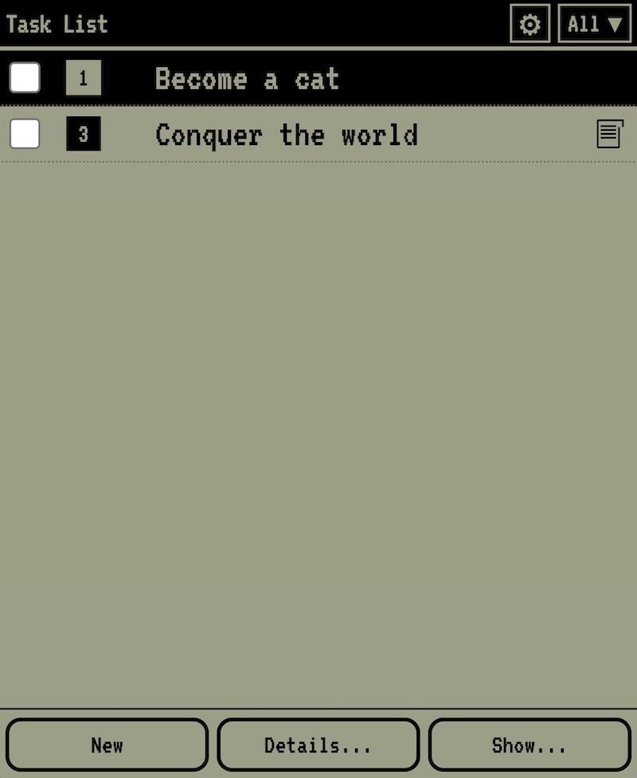

# PalmiTodo

A faithful recreation of the iconic Palm OS task manager as a Progressive Web App (PWA).

## About

PalmiTodo brings back the simplicity and efficiency of the legendary Palm OS task manager that millions of users relied on daily. This web application reproduces the exact look, feel, and functionality of the original Palm task application, with the same distinctive green-tinted interface and pixel-perfect UI elements.

## Features

- ✅ **Classic Palm OS Interface** - Authentic green monochrome display with bitmap fonts
- 📝 **Task Management** - Create, edit, and organize tasks with priorities (1-5)
- 📂 **Categories** - Organize tasks by customizable categories
- 📅 **Due Dates** - Set and track task deadlines with Palm-style calendar picker
- 📌 **Notes** - Add detailed notes to any task
- 💾 **Backup/Restore** - Export and import your tasks as JSON files
- 🌍 **Multilingual** - Available in English and French
- 📱 **PWA Support** - Install on your home screen for native app experience
- 🔄 **Offline First** - Works completely offline once installed

## Installation

### Quick Access
Visit [https://l0d0v1c.github.io/palmitodo/](https://l0d0v1c.github.io/palmitodo/)

### Install as App

For the best experience, install PalmiTodo on your device's home screen:

#### iOS (iPhone/iPad)
1. Open Safari and navigate to the app URL
2. Tap the Share button (⎙)
3. Scroll down and tap "Add to Home Screen"
4. Tap "Add"

#### Android
1. Open Chrome and navigate to the app URL
2. Tap the menu (⋮)
3. Select "Install app" or "Add to Home screen"
4. Confirm installation

## Usage

### Basic Operations
- **Add Task**: Tap the "New" button
- **Edit Task**: Double-click on any task text
- **Set Priority**: Click on the priority number to cycle through 1-5
- **Mark Complete**: Check the checkbox next to the task
- **Task Details**: Select a task and tap "Details..."

### Advanced Features
- **Categories**: Tap the category dropdown in the header to filter tasks
- **Preferences**: Use "Show..." button to customize display options
- **Backup**: Settings > Backup icon to save your tasks
- **Restore**: Settings > Folder icon to restore from backup

## Technology

Built with vanilla JavaScript, CSS, and HTML5, PalmiTodo demonstrates that powerful applications don't need heavy frameworks. The app uses:

- Service Workers for offline functionality
- LocalStorage for data persistence
- Web App Manifest for installability
- SVG graphics for crisp, scalable icons

## Nostalgia Factor

PalmiTodo is a love letter to the Palm OS era (1996-2007), when PDAs revolutionized personal organization. The original Palm task manager was renowned for its:

- Instant responsiveness
- Intuitive interface
- No-nonsense functionality
- Perfect balance of features and simplicity

This recreation maintains those principles while leveraging modern web technologies.

## Browser Support

- Chrome/Edge 90+
- Safari 14+
- Firefox 88+
- Any browser supporting PWA standards

## Contributing

Contributions are welcome! Feel free to submit issues or pull requests.

## License

MIT License - Feel free to use and modify as needed.

## Acknowledgments

- Original Palm OS interface designers for creating timeless UI patterns
- The Palm community for keeping the spirit alive
- VT323 font for authentic bitmap typography

---

*"The best interface is invisible" - Palm OS Philosophy*